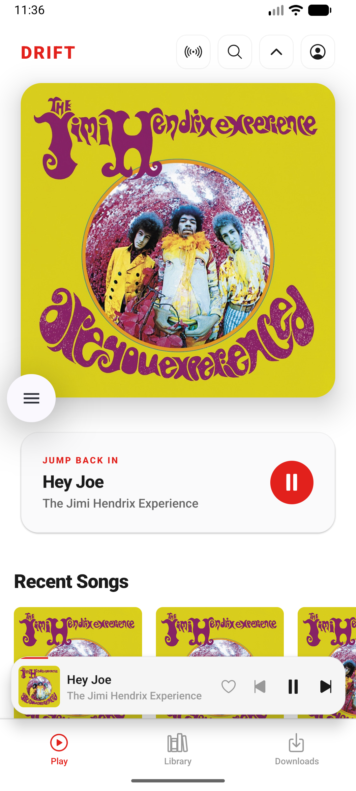
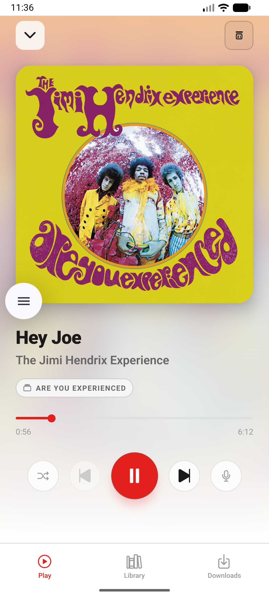
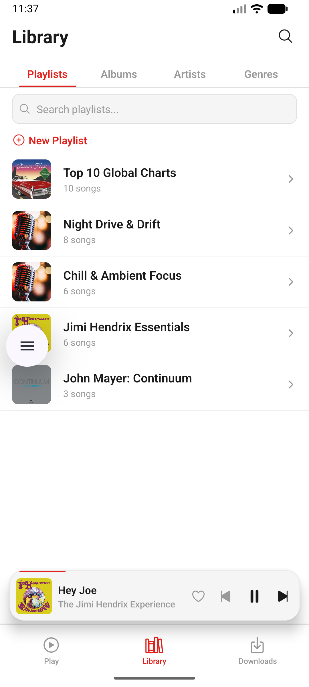
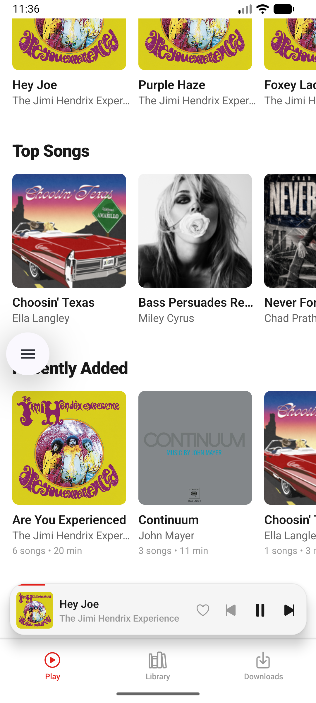
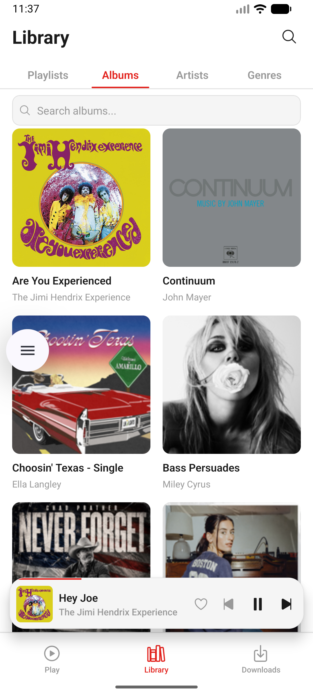
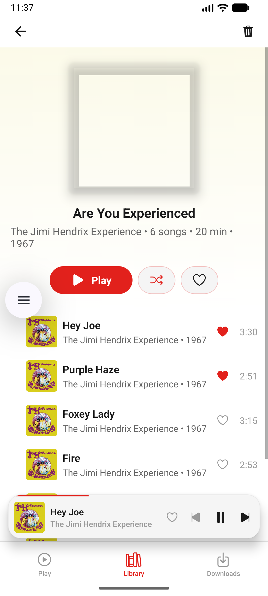
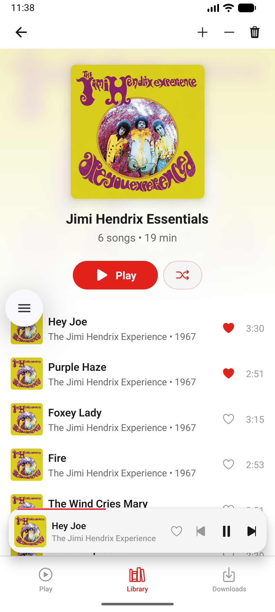

# Drift

Open-source Expo mobile client for servers implementing the Subsonic API.

The app uses standard Subsonic JSON endpoints for authentication, browsing,
search, playlists, playback, cover art, scrobbling, and offline downloads.
Server configuration is user-provided; no Drift server, account, or API
credentials are required.

This project is independent and is not affiliated with Feishin, Subsonic,
Navidrome, or any music service.

## Screenshots

| Home | Now Playing | Library / Playlists |
|------|-------------|---------------------|
|  |  |  |

| Recently Added | Albums | Album Detail | Playlist |
|----------------|--------|--------------|----------|
|  |  |  |  |
